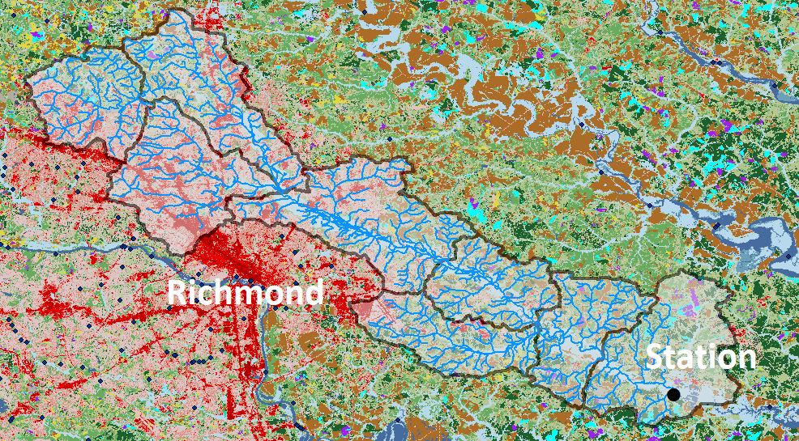
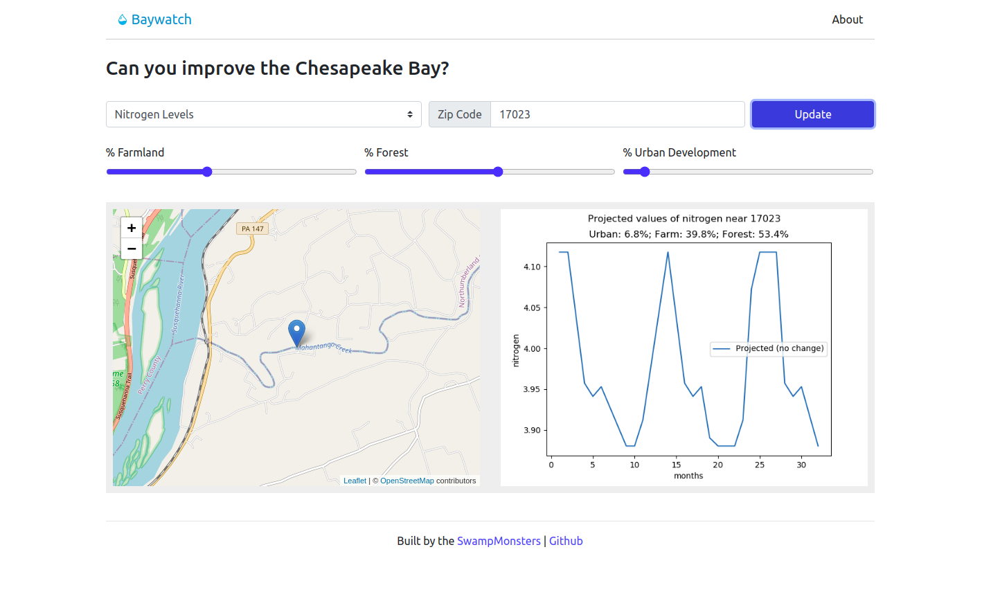

# HacktheBay Effect of Land Cover on Nitrogen
Using Land Cover Type of Upstream Area to Predict Pollution in the Chesapeake Bay Watershed

## Inspiration

We wanted to put our combined skill set to use for an environmentally important goal. Since we all live in and enjoy the Chesapeake 
Bay watershed, this hackathon had particular meaning for us. Given our background in machine learning, statistics, and GIS, we thought 
we would try the Challenge 3, the machine learning option. It was important to us that the output could go beyond simply being a model 
to being a tool for scientific communication with our community. That is why we built an online interface for users to see how the 
actions within the watershed may affect pollution and improve water quality.

## How we built it

We iteratively created a workflow to prepare data for analysis, created and trained a machine learning model to predict nitrogen
 pollution at sampling sites based on land cover inputs, and built an online interface for public interaction.

We focused on nitrogen pollution because it is one of the main drivers of ecological impairment in the Chesapeake Bay. Nitrogen 
pollution is also well predicted by land cover, for which there is a recent USGS provided dataset on which we can build a model. 
There are also well known and established mitigation measures for nitrogen pollution, such as stream buffers and wetland catchments, 
which are easy for the public to understand and begin to implement to improve water quality.

In our data exploration we found a seasonal effect on nitrogen levels, with lower levels in the summer (Figure 1 and Figure 2). 
We also noticed that more samples, particularly in the bay itself, were taken in the summer.

Figure 1: The average nitrogen by station, broken out by month.

Figure 2: A boxplot of the nitrogen levels broken down by month across all locations. The means clearly change seasonally.

First, we extracted land cover within watersheds. We used the public National Land Cover Dataset (NLCD) 2016 Science product 
created by USGS to provide land cover data at a 30 meter resolution. We used the USGS watershed basin boundaries (which are named 
using hydrologic unit codes, called HUCs) as boundaries to distinguish which land cover drained into which waterways. The number 
of pixels of each land cover type and their percentage within the HUC boundary were compared to the water quality sampling data taken 
at stations within those boundaries using various statistical correlation tests and then input into a machine learning model (gradient 
boosting regression). We tested HUC sizes 8, 10, and 12, with 8 being larger regions and 12 being the smallest.

At first, even using the smallest land cover grouping at the HUC 12 level of boundary, we did not find as strong a relationship between 
land cover and station sampling data as we expected, given the causal relationship between them recorded in peer-reviewed literature. 
We considered this may be because the water station samples were influenced by upstream water basins that we had not included.

To address this concern, we additionally extracted land cover in HUCs upstream of each sampling station. This was done by using the 
National Hydrography Dataset to create an iterative tool to identify which waterways flowed downstream to each sampling station. We 
used the selected set of streams (see Figure 3) for each sampling station to identify which HUCs the streams crossed through on their 
way to the sampling station. We then used these grouped upstream HUCS to examine the land cover type amounts and percentages for the 
waterways flowing into the sampling stations.

Figure 3: All the streams feeding into a particular station.

Data analysis included Pearson correlations (see Figure 4) to decide which major groups should be included in the interface. Various 
machine learning models were tested, from which we selected gradient boosting regression was selected. The R^2 for these models 
(see Figure 5) showed that when all extractions were considered, the best fit was achieved. However, the two best fit models included 
the upstream tracing land cover extractions. The second best fit was only slightly lower, and achieved using only the upstream tracing 
that grouped influential HUC 12 watersheds. R^2 for models which explicitly look at comparing the usefulness of different spatial 
granularities for landcover also support that the upstream HUC data is most useful and that HUC8 to too large an area to be indicative of 
water quality (see Figure 5). This supported our hypothesis and general literature consensus that upstream land cover was as influential 
as the land cover immediately surrounding the sampling station. The feature importance graph (see Figure 6) indicates that cultivate 
crops, open water, and wetlands all play an important role in predicting nitrogen levels.

Figure 4: The correlation between land use types, and between land use types and nitrogen.

Figure 5: The R^2 values for the different models. We can see from this that the basic variables (LLAMY) plus land use and upstream land use datasets performed the best.

Figure 6: Feature importance graph.

## Challenges we ran into

One challenge was subsetting the land cover upstream from the stations to reflect contributing runoff sources as closely as possible. 
First, the hydrography data needed to be downloaded with an intact geometric system, meaning the lines representing streamflow had to 
be collected logically to indicate directionality. Then we had to learn to manipulate this data using the associated tools. The large 
number of stations meant this process must be automated. Models were created to batch process our stream selection and to extract land 
cover for those streams.

Further challenges arose in finding the most appropriate statistical analysis. We needed to measure complex correlations between a large 
number of land cover types and thousands of samples. This took a great deal of literature review and expertise to select and test 
appropriate models.

## Data & Modeling

The modeling code lives in the `ModelCode` directory, and the data transformation scripts live in the `eda` directory.

## Demo

The `react` and `flask` demo lives in the `demo` directory.
It requires running both the flask server (`cd demo/server ; python app.py`) and the React front-end (`cd demo/client ; npm start`) once you have the requirements installed.

## Screenshots

